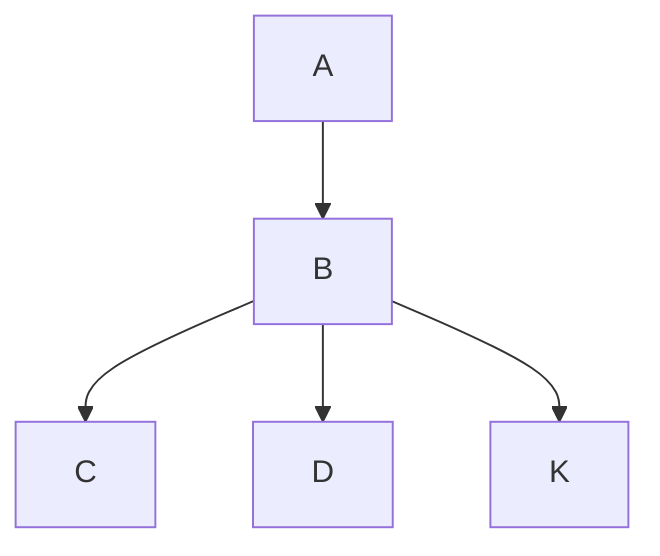

<a :href="$withBase('/help.puml')">帮助文档</a>

思维转变

1. 从技术驱动到服务驱动
   1. 从我想学习什么语言，到我实现这个服务需要用什么语言

业务梳理：

1. 梳理头寸主流程、及细节流程

小功能：

1. 开发一个在线markDown编辑器，支持查看文件列表、新增、修改、删除文件 类似于showDocs
   1. 后期支持下载、导出、转换格式等
2. 开发一个图片存储服务，支持上传、下载、预览、外链功能

