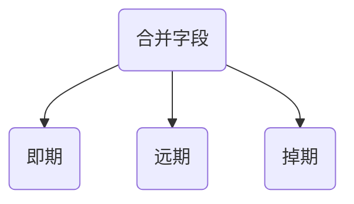

订单改造

# 表合并-公共表抽取

## 一、订单表抽取

即期、远期、掉期订单表抽取公共字段，提取到同一张表中，

解决问题：

1. 减少查询
2. 统一订单核心操作实体

### 字段对应关系

| 即期                      | 远期                | 掉期                                            | CSWAP                                          | 释义                                                     | 同   | 即   | 远   | 掉   |      |
| :------------------------ | ------------------- | ----------------------------------------------- | ---------------------------------------------- | -------------------------------------------------------- | ---- | ---- | ---- | ---- | ---- |
| `ORDER_ID`                | `ORDER_ID`          | `ORDER_ID`                                      | `ORDER_ID`                                     | 订单编号                                                 | √    |      |      |      |      |
|                           | `QUOTE_REQ_ID`      | `QUOTE_REQ_ID`                                  |                                                | 请求牌价号                                               | √    |      |      |      | ×    |
|                           | `QUOTE_ID`          | `QUOTE_ID`                                      |                                                | 牌价号                                                   | √    |      |      |      | ×    |
| `INSTRUMENT`              | `INSTRUMENT`        | `INSTRUMENT`                                    | `INSTRUMENT`                                   | 产品类型： FXSPOT->外汇即期 PMSPOT->贵金属即期 | √    |      |      |      |      |
| `BOOK`                    | `BOOK`              | `BOOK`                                          | `BOOK`                                         | 组合                                                     | √    |      |      |      |      |
| `FOLDER`                  | `FOLDER`            | `FOLDER`                                        | `FOLDER`                                       | 账户                                                     | √    |      |      |      |      |
| `CHANNEL`                 | `CHANNEL`           | `CHANNEL`                                       | `CHANNEL`                                      | 渠道                                                     | √    |      |      |      |      |
| `BUY_SELL`                | `BUY_SELL`          | `BUY_SELL`                                      | `BUY_SELL`                                     | 买卖方向 B - 买 S - 卖                         | √    |      |      |      |      |
| `ORDER_TYPE`              | `ORDER_TYPE`        | `ORDER_TYPE`                                    | `ORDER_TYPE`                                   | 订单类型                                                 | √    |      |      |      |      |
| `ORDER_STATUS`            | `ORDER_STATUS`      | `ORDER_STATUS`                                  | `ORDER_STATUS`                                 | 订单状态                                                 | √    |      |      |      |      |
| `PAIR`                    | `PAIR`              | `PAIR`                                          | `PAIR`                                         | 货币对（symbol交易品种）                                 | √    |      |      |      |      |
|                           |                     |                                                 |                                                | 第二货币标识                                             |      |      |      |      |      |
| `DEALT_CCY`               | `DEALT_CCY`         | `DEALT_CCY`                                     | BASE_CCY      | 交易货币                                                 | √    |      |      |      | ×    |
| `ORDER_QTY`               | `ORDER_QTY`         | `ORDER_QTY`                                     | `ORDER_QTY`                                    | 交易金额                                                 | √    |      |      |      |      |
| `CLOSE_QTY`               |                     |                                                 |                                                | 已完成交易金额                                           | √    |      |      |      |      |
|                           |                     |                                                 | REMAIN_QTY    | 剩余量                                                   | √    |      |      |      | ×    |
| `SPOT_RATE`               | `SPOT_RATE`         | `SPOT_RATE`                                     | PRICE         | 即期汇率（PRICE 价格）                                   | √    |      |      |      |      |
| `DELIVERY_DATE`           |                     |                                                 |                                                | 交割日                                                   |      |      |      |      | ×    |
| `TRIGGER_TYPE`            |                     |                                                 |                                                | 监控价格类型                                             |      |      |      |      | ×    |
| `TRIGGER_PRICE`           |                     |                                                 |                                                | 监控价格1                                                |      |      |      |      | ×    |
| `TRIGGER_PRICE2`          |                     |                                                 |                                                | 监控价格2                                                |      |      |      |      | ×    |
| `ALERT_TYPE`              |                     |                                                 |                                                | 预警类型                                                 |      |      |      |      | ×    |
| `BRANCH_CODE`             | `BRANCH_CODE`       | `BRANCH_CODE`                                   |                                                | 请求方机构号                                             | √    |      |      |      |      |
| `TRADER`                  | `TRADER`            | `TRADER`                                        | `TRADER`                                       | 请求交易员                                               | √    |      |      |      |      |
|                           |                     |                                                 | `UPDATE_TRADER`                                | 最后更新交易员                                           |      |      |      |      | ×    |
| `EXPIRE_TYPE`             |                     |                                                 |                                                | 时效类型                                                 | √    |      |      |      |      |
| `EXPIRE_DATE`             |                     |                                                 |                                                | 订单过期时间                                             | √    |      |      |      |      |
| `MASTER_ORDER_ID`         |                     |                                                 | `COMM_ID`                                      | 组合ID                                                   | √    |      |      |      |      |
| `SOURCE_CHANNEL`          | `SOURCE_CHANNEL`    | `SOURCE_CHANNEL`                                | `SOURCE_CHANNEL`                               | 来源渠道标识                                             | √    |      |      |      |      |
| `ENTITY`                  | `ENTITY`            | `ENTITY`                                        |                                                | 实体                                                     | √    |      |      |      |      |
| `CONTRACTCODE`            | `CONTRACTCODE`      | CONTRACT_CODE  | CONTRACT_CODE | 合约代码                                                 | √    |      |      |      |      |
| `ORDER_DATE`              | `ORDER_DATE`        | `ORDER_DATE`                                    | `ORDER_DATE`                                   | 订单生成日期                                             | √    |      |      |      |      |
| `ORDER_TIME`              | `ORDER_TIME`        | `ORDER_TIME`                                    | `ORDER_TIME`                                   | 订单生成时间                                             | √    |      |      |      |      |
| `CREATE_DATE_TIME`        | `CREATE_DATE_TIME`  | `CREATE_DATE_TIME`                              | `CREATE_DATE_TIME`                             | 创建时间                                                 | √    |      |      |      |      |
| `UPDATE_DATE_TIME`        | `UPDATE_DATE_TIME`  | `UPDATE_DATE_TIME`                              | `UPDATE_DATE_TIME`                             | 更新时间                                                 | √    |      |      |      |      |
|                           |                     |                                                 |                                                | 策略编号                                                 |      |      |      |      |      |
| `SERIAL_NO`               |                     |                                                 |                                                | 平盘/策略下单流水号唯一序列号                            | √    |      |      |      | ×    |
| `ATTENTION`               |                     |                                                 |                                                | 关注                                                     | √    |      |      |      |      |
| `ISSPLIT`                 |                     |                                                 |                                                | 订单是否可拆分                                           | √    |      |      |      | ×    |
| `SEQ_NO`                  |                     |                                                 | `SEQ_NO`                                       | 组合订单序列号                                           | √    |      |      |      |      |
|                           |                     |                                                 |                                                | 组合单类型                                               |      |      |      |      |      |
| `MARKET_TYPE`             |                     |                                                 |                                                |                                                          | √    |      |      |      | ×    |
| `NOTE1`                   |                     | `NOTE1`                                         |                                                |                                                          |      |      |      |      | ×    |
| `NOTE2`                   |                     | `NOTE2`                                         |                                                |                                                          |      |      |      |      | ×    |
| `NOTE3`                   |                     | `NOTE3`                                         |                                                |                                                          |      |      |      |      | ×    |
| `NOTE4`                   |                     | `NOTE4`                                         |                                                |                                                          |      |      |      |      | ×    |
| `NOTE5`                   |                     | `NOTE5`                                         |                                                |                                                          |      |      |      |      | ×    |
| `PD`                      |                     |                                                 |                                                | 滑点                                                     |      |      |      |      | ×    |
| `CPTY`                    | `CPTY`              | `CPTY`                                          |                                                | 执行市场 1 - 直通式 2 - 本地                   | √    |      |      |      |      |
| `PRICE_MODEL`             |                     |                                                 |                                                | 价格模型                                            |      |      |      |      | ×    |
| `COUNTERPARTIES`          |                     |                                                 |                                                | 交易对手                                                 |      |      |      |      |      |
| `DISPLAY_QTY`             |                     |                                                 | `ICEBERG_QTY`                                  | 冰山量                                                   |      |      |      |      | ×    |
| `RANDOMISE_AMOUNT`        |                     |                                                 |                                                | "Y-开启随机量 N-不开启随机量"                        |      |      |      |      | ×    |
| `DISPLAY_HIGH_RANDOMTIME` |                     |                                                 |                                                | 冰山最大随机时间,秒数                                    |      |      |      |      | ×    |
| `PARTY_ID`                |                     |                                                 |                                                | 本方机构4位码，CFETS必输                                 |      |      |      |      |      |
| `BEHAVIOR`                |                     |                                                 |                                                | LOOP单执行规则                                           |      |      |      |      |      |
| `TRIGGER_PRICE3`          |                     |                                                 |                                                | 参考价格3                                                |      |      |      |      |      |
|                           | `FAR_RATE`          | `FAR_RATE`                                      |                                                | 远端汇率                                                 |      |      |      |      |      |
|                           | `FAR_POINT`         | `FAR_POINT`                                     |                                                | 远端升贴水                                               |      |      |      |      |      |
|                           | `FAR_MATURITY_DATE` | `FAR_DELIVERY_DATE` |                                                | 远端交割日                                               |      |      |      |      |      |
|                           | `FAR_TENORS`        | `FAR_TENORS`                                    |                                                | 远端期限                                                 |      |      |      |      |      |
|                           |                     |                                                 |                                                |                                                          |      |      |      |      |      |
|                           |                     | `COMMENTS`                                      |                                                | 备注                                                     |      |      |      |      |      |
|                           |                     | `NEAR_RATE`                                     |                                                | 近端汇率                                                 |      |      |      |      |      |
|                           |                     | `NEAR_POINT`                                    |                                                | 近端升贴水                                               |      |      |      |      |      |
|                           |                     | `NEAR_TENORS`                                   |                                                | 近端期限                                                 |      |      |      |      |      |
|                           |                     | `NEAR_DELIVERY_DATE`                            |                                                | 近端交割日                                               |      |      |      |      |      |
|                           |                     | `SWAP_POINT`                                    |                                                | 掉期点                                                   |      |      |      |      |      |
|                           |                     |                                                 | `SETTL_TYPE`                                   | 掉期品种                                                 |      |      |      |      |      |
|                           |                     |                                                 | `MONITOR_QTY`                                  | 监控数量                                                 |      |      |      |      |      |
|                           |                     |                                                 | `MONITOR_PROCE`                                | 监控价格                                                 |      |      |      |      |      |
|                           |                     |                                                 | `PAYMENT_POINT`                                | 补偿点                                                   |      |      |      |      |      |
|                           |                     |                                                 | `DURATION_DAYS`                                | 存续天数                                                 |      |      |      |      |      |
|                           |                     |                                                 | `UPDATE_TIME`                                  | 状态更新时间                                             |      |      |      |      |      |
|                           |                     |                                                 | `EFFECT_TIME`                                  | 有效时间                                                 |      |      |      |      |      |
|                           |                     |                                                 | `ACTIVE_TIME`                                  | 激活时间                                                 |      |      |      |      |      |
|                           |                     |                                                 | `OPER_FLAG`                                    |                                                          |      |      |      |      |      |
|                           |                     |                                                 | `APPL_ERROR_CODE`                              | 错误代码                                                 |      |      |      |      |      |
|                           |                     |                                                 | `APPL_ERROR_DESC`                              | 错误原因                                                 |      |      |      |      |      |

### 共同字段抽取

|        | 基础表字段 | 释义     | 新增 | 改变 | 备注 |
| ---------- | ---------- | ---------- | ---------- | ---------- | ---------- |
| 1 | `ORDER_ID` | 订单编号 |  |  |  |
| 2             | `INSTRUMENT`              | 产品类型： FXSPOT->外汇即期 PMSPOT->贵金属即期 |  |  |  |
| 3                   | `BOOK`                    | 组合                                                     |                                                      |                                                      |                                                      |
| 4                 | `FOLDER`                  | 账户                                                     |                                                      |                                                      |                                                      |
| 5                | `CHANNEL`                 | 渠道                                                     |                                                      |                                                      |                                                      |
| 6               | `BUY_SELL`                | 买卖方向 B - 买 S - 卖                         |                          |                          |                          |
| 7             | `ORDER_TYPE`              | 订单类型                                                 |                                                  |                                                  |                                                  |
| 8           | `ORDER_STATUS`            | 订单状态                                                 |                                                  |                                                  |                                                  |
| 9                   | `symbol`                | 交易品种， 外汇下代表`货币对` 本币代表债权`编码`     |      | √    |     |
| 10            | `ORDER_QTY`               | 交易量                                                |                                                 |                                                 |                                                 |
| 11            | `CLOSE_QTY`               | 成交量                                     |                                      |                                      |                                      |
| 12            | `PRICE`        | 价格 即期-即期汇率 远期-远期汇率（全价） 掉期-掉期点  |    | √  |   |
| 13 | `BRANCH_CODE` | 请求方机构号 |  |  |  |
| 14 | `TRADER` | 请求交易员 |  |  |  |
| 15 | `SOURCE_CHANNEL` | 来源渠道标识 |  |  |  |
| 16               | `ENTITY`                  | 实体                                                     |                                                      |                                                      |                                                      |
| 17         | `CONTRACTCODE`            | 合约代码                                                 |                                                  |                                                  |                                                  |
| 18          | `ORDER_DATE`              | 订单生成日期                                             |                                              |                                              |                                              |
| 19          | `ORDER_TIME`              | 订单生成时间                                             |                                              |                                              |                                              |
| 20     | `CREATE_DATE_TIME`        | 创建时间                                                 |                                                  |                                                  |                                                  |
| 21     | `UPDATE_DATE_TIME`        | 更新时间                                                 |                                                  |                                                  |                                                  |
| 22 | `MASTER_ORDER_ID` | 组合ID |  |  |  |
| 23 | `SEQ_NO` | 组合订单序列号 |  |  |  |
| 24 | `MASTER_TYPE` | 组合单类型 | √ |  |  |
| 25 | `EXPIRE_DATE` | 订单过期时间 |  |  |  |
| 26 | `EXPIRE_TYPE` | 时效类型 |  |  |  |
| 27 | `CPTY` | 执行市场 1 - 直通式 2 - 本地 |  |  |  |
| 28 | `SERIAL_NO` | 平盘/策略下单流水号唯一序列号 |  |  |  |
| 29 | `ATTENTION` | 是否关注 |  |  |  |
| 30 | TRADE_AMOUNT | `货币二的总金额，用来计算平均价`，价格*成交量 | √ |  |  |
| 31 | RUN_ID | 策略编号 | √ |  |  |
| 32 | RUN_NAME | 策略编号 | √ |  |  |

### 即期子表

| 即期                      | 释义                              |      |
| ------------------------- | --------------------------------- | ---- |
| `DISPLAY_QTY`             | 冰山量                            |      |
| `RANDOMISE_AMOUNT`        | "Y-开启随机量 N-不开启随机量" |      |
| `DISPLAY_HIGH_RANDOMTIME` | 冰山最大随机时间,秒数             |      |
| `PRICE_MODEL`             | 价格模型                          |      |
| `PARTY_ID`                | 本方机构4位码，CFETS必输          |      |
| `BEHAVIOR`                | LOOP单执行规则                    |      |
| `DELIVERY_DATE`           | 交割日                            |      |
| `TRIGGER_TYPE`            | 监控类型                          |      |
| `TRIGGER_PRICE`           | 监控价格                          |      |
| `TRIGGER_PRICE2`          | 监控价格2                         |      |
| `TRIGGER_PRICE3`          | 监控价格3                         |      |
| `ALERT_TYPE`              | 预警类型                          |      |

### 远期子表

| 远期                | 释义     |      |
| ------------------- | -------- | ---- |
| `FAR_RATE`          | 远端汇率 |      |
| `FAR_POINT`         |          |      |
| `FAR_MATURITY_DATE` |          |      |
| `FAR_TENORS`        |          |      |
|                     |          |      |

### 特殊字段

| 即期 | 远期 | 掉期 | CSWAP | 释义 |
| ---- | ---- | ---- | ----- | ---- |
|  | `QUOTE_REQ_ID` | `QUOTE_REQ_ID` |  | 请求牌价号 |
|  | `QUOTE_ID` | `QUOTE_ID` |  | 牌价号 |
| `PRICE_MODEL`             |                     |                                                 |                                                | 价格模型                                            |
| `COUNTERPARTIES`          |                     |                                                 |                                                | 交易对手                                                 |
| `DISPLAY_QTY`             |                     |                                                 | `ICEBERG_QTY`                                  | 冰山量                                                   |
| `RANDOMISE_AMOUNT`        |                     |                                                 |                                                | "Y-开启随机量 N-不开启随机量"                        |
| `DISPLAY_HIGH_RANDOMTIME` |                     |                                                 |                                                | 冰山最大随机时间,秒数                                    |
| `PARTY_ID`                |                     |                                                 |                                                | 本方机构4位码，CFETS必输                                 |
| `BEHAVIOR`                |                     |                                                 |                                                | LOOP单执行规则                                           |
| `TRIGGER_PRICE3`          |                     |                                                 |                                                | 参考价格3                                                |
|                           | `FAR_RATE`          | `FAR_RATE`                                      |                                                | 远端汇率                                                 |
|                           | `FAR_POINT`         | `FAR_POINT`                                     |                                                | 远端升贴水                                               |
|                           | `FAR_MATURITY_DATE` | `FAR_DELIVERY_DATE` |                                                | 远端交割日                                               |
|                           | `FAR_TENORS`        | `FAR_TENORS`                                    |                                                | 远端期限                                                 |
|                           |                     |                                                 |                                                |                                                          |
|                           |                     | `COMMENTS`                                      |                                                | 备注                                                     |
|                           |                     | `NEAR_RATE`                                     |                                                | 近端汇率                                                 |
|                           |                     | `NEAR_POINT`                                    |                                                | 近端升贴水                                               |
|                           |                     | `NEAR_TENORS`                                   |                                                | 近端期限                                                 |
|                           |                     | `NEAR_DELIVERY_DATE`                            |                                                | 近端交割日                                               |
|                           |                     | `SWAP_POINT`                                    |                                                | 掉期点                                                   |
|                           |                     |                                                 | `SETTL_TYPE`                                   | 掉期品种                                                 |
|                           |                     |                                                 | `MONITOR_QTY`                                  | 监控数量                                                 |
|                           |                     |                                                 | `MONITOR_PROCE`                                | 监控价格                                                 |
|                           |                     |                                                 | `PAYMENT_POINT`                                | 补偿点                                                   |
|                           |                     |                                                 | `DURATION_DAYS`                                | 存续天数                                                 |
|                           |                     |                                                 | `UPDATE_TIME`                                  | 状态更新时间                                             |
|                           |                     |                                                 | `EFFECT_TIME`                                  | 有效时间                                                 |
|                           |                     |                                                 | `ACTIVE_TIME`                                  | 激活时间                                                 |
|                           |                     |                                                 | `OPER_FLAG`                                    |                                                          |
|                           |                     |                                                 | `APPL_ERROR_CODE`                              | 错误代码                                                 |
|                           |                     |                                                 | `APPL_ERROR_DESC`                              | 错误原因                                                 |

## 二、订单处理表

### 需要注意的点

1. 不通渠道可能要求客户端参考编号递增且唯一
2. 

### 字段对比

| 即期               | 远期               | 掉期               | CSWAP              | XSWAP                     | 释义                          |
| ------------------ | ------------------ | ------------------ | ------------------ | ------------------------- | ----------------------------- |
| `DEAL_ID`          | `DEAL_ID`          | `DEAL_ID`          | `DEAL_ID`          | `DEAL_ID`                 | deal流水号                    |
| `ORDER_ID`         | `ORDER_ID`         | `ORDER_ID`         | `ORDER_ID`         | `ORDER_ID`                | 订单ID                        |
| `QUOTE_REQ_ID`     | `QUOTE_REQ_ID`     | `QUOTE_REQ_ID`     |                    |                           | 牌价请求号                    |
| `QUOTE_ID`         | `QUOTE_ID`         | `QUOTE_ID`         |                    |                           | 牌价号                        |
| `ORDER_TYPE`       | `ORDER_TYPE`       | `ORDER_TYPE`       | `ORDER_TYPE`       | `ORDER_TYPE`              | 订单类型                      |
| `PAIR`             | `PAIR`             | `PAIR`             | `PAIR`             |                           | 货币对                        |
| `DEALT_CCY`        | `DEALT_CCY`        | `DEALT_CCY`        |                    |                           | 交易货币                      |
| `BUY_SELL`         | `BUY_SELL`         | `BUY_SELL`         | `BUY_SELL`         | `SIDE`                    | 买卖方向                      |
| `CHANNEL`          | `CHANNEL`          | `CHANNEL`          |                    | `CHANNEL`                 | 交易渠道                      |
| `DEAL_STATUS`      | `DEAL_STATUS`      | `DEAL_STATUS`      |                    |                           | deal订单状态                  |
| `SPOT_RATE`        |                    | `SPOT_RATE`        | `PRICE`            | `PRICE`                   | 即期汇率                      |
| `ORDER_QTY`        | `ORDER_QTY`        | `ORDER_QTY`        | `ORDER_QTY`        | `ORDER_QTY`               | 交易量                        |
| `CLOSE_QTY`        | `CLOSE_QTY`        | `CLOSE_QTY`        | `FAIL_QTY`         | `LAST_QTY`                | 成交量                        |
| `RETCODE`          | `RETCODE`          | `RETCODE`          | `RETCODE`          | `RET_CODE`                | 风控返回码                    |
| `RETCOMMENTS`      | `RETCOMMENTS`      | `RETCOMMENTS`      | `RETCOMMENTS`      | `RET_COMMENTS`            | 风控返回说明                  |
| `OUT_TRADEID`      | `OUT_TRADEID`      | `OUT_TRADEID`      |                    |                           | 外部交易流水号                |
| `DELIVERY_DATE`    |                    |                    |                    |                           | 交割日                        |
| `ORDER_DATE`       | `ORDER_DATE`       | `ORDER_DATE`       |                    |                           | 订单生成日期                  |
| `ORDER_TIME`       | `ORDER_TIME`       | `ORDER_TIME`       |                    |                           | 订单生成时间                  |
| `TRADE_DATE`       | `TRADE_DATE`       | `TRADE_DATE`       | `TRADE_DATE`       |                           | 订单成交日期                  |
| `TRADE_TIME`       | `TRADE_TIME`       | `TRADE_TIME`       | `TRADE_TIME`       |                           | 订单成交时间                  |
| `CREATE_DATE_TIME` | `CREATE_DATE_TIME` | `CREATE_DATE_TIME` | `CREATE_DATE_TIME` | `CREATE_DATE_TIME`        | 创建时间                      |
| `UPDATE_DATE_TIME` | `UPDATE_DATE_TIME` | `UPDATE_DATE_TIME` | `UPDATE_DATE_TIME` | `UPDATE_DATE_TIME`        | 更新时间                      |
| `REJREASON`        | `REJREASON`        | `REJREASON`        |                    |                           | 订单拒绝原因                  |
| `RSINXLIST`        | `RSINXLIST`        | `RSINXLIST`        |                    |                           | 风控指标说明                  |
| `BASEPOINT`        |                    |                    |                    |                           | 价格精度位数                  |
| `TICKSIZE`         |                    |                    |                    |                           | 基点位数                      |
| CL_ORD_ID          |                    |                    |                    |                           | 客户端参考编号                |
| OUT_ORDER_ID       |                    |                    |                    |                           | 外汇交易中心orderId由外部生成 |
| SERIAL_NUM         |                    |                    |                    |                           | 头寸序列号                    |
|                    | FAR_POINT          | FAR_POINT          |                    |                           | 远端升贴水                    |
|                    | FAR_RATE           | FAR_RATE           |                    |                           | 远端汇率                      |
|                    | COUNTERPARTIES     |                    |                    |                           | 交易对手                      |
|                    |                    | FAIL_QTY           |                    |                           | 失败成交量                    |
|                    |                    | NEAR_RATE          |                    |                           | 近端汇率                      |
|                    |                    | NEAR_POINT         |                    |                           | 近端升贴水                    |
|                    |                    | SWAP_POINT         |                    |                           | 掉期点                        |
|                    |                    | AVG_DEAL_RATE      |                    |                           | 掉期点均价                    |
|                    |                    |                    | CSWAP_ORDER_ID     |                           | 外部订单编号                  |
|                    |                    |                    | OPER_STATUS        |                           | 操作状态                      |
|                    |                    |                    | STATUS             |                           |                               |
|                    |                    |                    | EXEC_TYPE          |                           |                               |
|                    |                    |                    | STATUS_DEC         |                           |                               |
|                    |                    |                    | SETTL_TYPE         |                           | 掉期品种                      |
|                    |                    |                    | EXPIRE_TIME        | EXPIRE_TIME               |                               |
|                    |                    |                    | CPTY               |                           |                               |
|                    |                    |                    | TEXT               |                           | 订单状态描述                  |
|                    |                    |                    |                    | ClORD_ID                  | 客户端参考编号                |
|                    |                    |                    |                    | MKT_ORDER_ID              | 交易中心订单编号              |
|                    |                    |                    |                    | WORKER                    | 用户信息                      |
|                    |                    |                    |                    | DATA_SOURCE               | 数据来源                      |
|                    |                    |                    |                    | OPER_TYPE                 | 操作标示                      |
|                    |                    |                    |                    | ORDER_STATUS              | 订单状态                      |
|                    |                    |                    |                    | MARKET_INDICATOR          | 市场                          |
|                    |                    |                    |                    | OPER_CLOSE_FLAG           | 开平仓标示                    |
|                    |                    |                    |                    | REAL_TIME_UNDER_TAKE_FLAG | 实时承接标示                  |
|                    |                    |                    |                    | SECURITY_ID               | 合约品种                      |
|                    |                    |                    |                    | CONTRACT_TYPE             | 合约类型                      |
|                    |                    |                    |                    | CONTRACT_CODE             | 合约代码                      |
|                    |                    |                    |                    | LEFT_QTY                  | 剩余本金                      |
|                    |                    |                    |                    | BOOK                      |                               |
|                    |                    |                    |                    | FOLDER                    |                               |
|                    |                    |                    |                    | PARTY_ROLE_QUALIFIER      |                               |
|                    |                    |                    |                    | THIS_AGENCY_ID            |                               |
|                    |                    |                    |                    | THIS_ACCOUNT_NO           |                               |
|                    |                    |                    |                    | THIS_TRADER_ID            |                               |
|                    |                    |                    |                    | OTHER_AGENCY_ID           |                               |
|                    |                    |                    |                    | OTHER_ACCOUNT_NO          |                               |
|                    |                    |                    |                    | OTHER_TRADER_ID           |                               |
|                    |                    |                    |                    | TRANSACT_TIME             |                               |
|                    |                    |                    |                    | EXEC_ACK_STATUS           |                               |
|                    |                    |                    |                    | ORDER_GENERATOIN_TIME     |                               |
|                    |                    |                    |                    | APPL_ERROR_CODE           |                               |
|                    |                    |                    |                    | APPL_ERROR_DESC           |                               |
| 市场（ODM,QDM）    |                    |                    |                    |                           |                               |

## 三、订单成交表

### 字段对比

| 即期               | 远期               | 掉期                  | 释义                      | 备注 |
| ------------------ | ------------------ | --------------------- | ------------------------- | ---- |
| `TRADE_ID`         | `TRADE_ID`         | `TRADE_ID`            | 成交编号                  |      |
| `ORDER_ID`         | `ORDER_ID`         | `ORDER_ID`            | 订单ID                    |      |
| `ALGO_TACTICS_ID`  |                    |                       | 量化策略号                |      |
| `CHANNEL`          | `CHANNEL`          | `CHANNEL`             | 渠道                      |      |
| `CHANNEL_ORIGIN`   | `CHANNEL_ORIGIN`   | `CHANNEL_ORIGIN`      | 原渠道                    | ×    |
| `INSTRUMENT`       | `INSTRUMENT`       | `INSTRUMENT`          | 产品类型                  |      |
| `OUT_TRADE_ID`     | `OUT_TRADE_ID`     | `OUT_TRADE_ID`        |                           | ×    |
| `EXEC_ID`          | `EXEC_ID`          | `EXEC_ID`             | 执行号                    |      |
| `TRADE_WAY`        | `TRADE_WAY`        | `TRADE_WAY`           | 交易方式                  | ×    |
| `TRADE_STATUS`     | `TRADE_STATUS`     | `TRADE_STATUS`        | 交易状态                  | ×    |
| `REJ_REASON`       | `REJ_REASON`       | `REJ_REASON`          | 拒绝原因                  | ×    |
| `PAIR`             | `PAIR`             | `PAIR`                | 货币对 --> 交易品种       |      |
| 合约               |                    |                       |                           |      |
| `QUOTE_ID`         | `QUOTE_ID`         | `QUOTE_ID`            | 牌价号                    | ×    |
| `BUY_SELL`         | `BUY_SELL`         | `BUY_SELL`            | 交易方向                  |      |
| `CCY1`             | `CCY1`             | `CCY1`                | 货币1                     | ×    |
| `CCY2`             | `CCY2`             | `CCY2`                | 货币2                     | ×    |
| `BRANCH_CODE`      | `BRANCH_CODE`      | `BRANCH_CODE`         | 所属行                    |      |
| `TAKER_TRADER_ID`  | `TAKER_TRADER_ID`  | `TAKER_TRADER_ID`     | 交易柜员                  |      |
| `CPTY`             | `CPTY`             | `CPTY`                | 对手机构号(交易对手)      |      |
| `MAKER_TRADER_ID`  | `MAKER_TRADER_ID`  | `MAKER_TRADER_ID`     | 对手交易员                | ×    |
| `OUT_ACCOUNT_ID`   | `OUT_ACCOUNT_ID`   | `OUT_ACCOUNT_ID`      | 外部交易账号              | ×    |
| `TRADE_DATE`       | `TRADE_DATE`       | `TRADE_DATE`          | 交易日期                  |      |
| `TRADE_TIME`       | `TRADE_TIME`       | `TRADE_TIME`          | 交易时间                  |      |
| `COMMENTS`         | `COMMENTS`         | `COMMENTS`            | 交易描述                  | ×    |
| `DEALT_CCY`        | `DEALT_CCY`        | `DEALT_CCY`           | 成交交易货币              | ×    |
| `BOOK`             | `BOOK`             | `BOOK`                | 组合                      |      |
| `FOLDER`           | `FOLDER`           | `FOLDER`              | 账户                      |      |
| `ENTITY`           | `ENTITY`           | `ENTITY`              | 实体                      |      |
| `ENTITY_ID`        | `ENTITY_ID`        | `ENTITY_ID`           | 实体ID                    | ×    |
| `ORDER_TYPE`       | `ORDER_TYPE`       | `ORDER_TYPE`          | 订单类型                  | ×    |
| `CREATE_DATE_TIME` | `CREATE_DATE_TIME` | `CREATE_DATE_TIME`    | 创建时间                  |      |
| `UPDATE_DATE_TIME` | `UPDATE_DATE_TIME` | `UPDATE_DATE_TIME`    | 更新时间                  |      |
| `RISK_LIMIT_ID`    | `RISK_LIMIT_ID`    | `RISK_LIMIT_ID`       | 风控流水号                | ×    |
|                    |                    |                       |                           |      |
|                    | `SPOT_VALUE_DATE`  | `SPOT_VALUE_DATE`     | 即期起息日                | ×    |
| `DEAL_RATE`        | `DEAL_RATE`        | `SWAP_POINT`（掉期点) | 成交汇率                  |      |
| `INIT_RATE`        | `INIT_RATE`        |                       | 初始汇率                  | ×    |
| `AMOUNT1`          | `AMOUNT1`          | `NEAR_AMOUNT1`        | 金额1（债权和利率放金额） |      |
| `AMOUNT2`          | `AMOUNT2`          |                       | 金额2                     | ×    |
| `DELIVERY_DATE`    | `DELIVERY_DATE`    | `NEAR_DELIVERY_DATE`  | 交割日                    | ×    |
|                    | `SPOT_RATE`        |                       | 即期汇率                  | ×    |
|                    | `POINT`            |                       | 升贴水                    | ×    |
|                    | `TENOR`            |                       | 期限                      | ×    |
|                    |                    | `NEAR_RATE`           | 近端全价                  | ×    |
|                    |                    | `NEAR_INIT_RATE`      | 近端初始价                | ×    |
|                    |                    | `NEAR_SPOT_RATE`      | 近端即期价                | ×    |
|                    |                    | `NEAR_POINT`          | 近端升贴水                | ×    |
|                    |                    | `NEAR_AMOUNT1`        | 近端金额1                 | ×    |
|                    |                    | `NEAR_AMOUNT2`        | 近端金额2                 | ×    |
|                    |                    | `NEAR_TENOR`          | 近端期限                  | ×    |
|                    |                    | `NEAR_DELIVERY_DATE`  | 近端交割日                | ×    |
|                    |                    | `NEAR_BUY_SELL`       | 近端交易方向              | ×    |
|                    |                    | `FAR_RATE`            | 远端全价                  | ×    |
|                    |                    | `FAR_INIT_RATE`       | 远端初始价                | ×    |
|                    |                    | `FAR_SPOT_RATE`       | 远端即期价                | ×    |
|                    |                    | `FAR_POINT`           | 远端升贴水                | ×    |
|                    |                    | `FAR_AMOUNT1`         | 远端金额1                 | ×    |
|                    |                    | `FAR_AMOUNT2`         | 远端金额2                 | ×    |
|                    |                    | `FAR_TENOR`           | 远端期限                  | ×    |
|                    |                    | `FAR_DELIVERY_DATE`   | 远端交割日                | ×    |
|                    |                    | `FAR_BUY_SELL`        | 远端交易方向              | ×    |
| `SERIAL_NO`        |                    |                       | 平盘流水号                | ×    |

## 四、询价请求

### 字段对比

| 即期                   | 远期                       | 掉期                        | 释义                                           |
| ---------------------- | -------------------------- | --------------------------- | ---------------------------------------------- |
| `QUOTE_REQ_ID`         | `QUOTE_REQ_ID`             | `QUOTE_REQ_ID`              | 牌价请求号                                     |
| `REQUEST_TYPE`         | `REQUEST_TYPE`             | `REQUEST_TYPE`              | 请求类型：2->rfq；9->撤销                      |
| `INSTRUMENT`           | `INSTRUMENT`               | `INSTRUMENT`                | 产品类型：FXSPOT->外汇即期；PMSPOT->贵金属即期 |
| `CHANNEL`              | `CHANNEL`                  | `CHANNEL`                   | 交易渠道：多个渠道用分号分隔                   |
| `PAIR`                 | `PAIR`                     | `PAIR`                      | 货币对                                         |
| `DEALT_CCY`            | `DEALT_CCY`                | `DEALT_CCY`                 | 交易货币                                       |
| `CONTRACT_CODE`        | `CONTRACT_CODE`            | `CONTRACT_CODE`             | 合约代码                                       |
| `ORDER_QTY`            | `ORDER_QTY`                | `ORDER_QTY`                 | 交易量                                         |
| `BUY_SELL`             | `BUY_SELL`                 | `BUY_SELL`                  | 交易方向                                       |
| `TRADER`               | `TRADER`                   | `TRADER`                    | 请求交易员                                     |
| <u>`DELIVERY_DATE`</u> |                            |                             | <u>`交割日`</u>                                |
|                        |                            | <u>`NEAR_TENORS`</u>        | <u>`近端期限`</u>                              |
|                        |                            | <u>`NEAR_DELIVERY_DATE`</u> | <u>`近端交割日`</u>                            |
|                        | <u>`FAR_TENORS`</u>        | <u>`FAR_TENORS`</u>         | <u>`远端期限`</u>                              |
|                        | <u>`FAR_DELIVERY_DATE`</u> | <u>`FAR_DELIVERY_DATE`</u>  | <u>`远端交割日`</u>                            |
| `FOLDER`               | `FOLDER`                   | `FOLDER`                    | `交易账户`                                     |
| `BOOK`                 | `BOOK`                     | `BOOK`                      | `组合`                                         |
| `BRANCH_CODE`          | `BRANCH_CODE`              | `BRANCH_CODE`               | `请求方机构号`                                 |
| `ENTITY`               | `ENTITY`                   | `ENTITY`                    | `实体`                                         |
| `QUOTE_STATUS`         | `QUOTE_STATUS`             | `QUOTE_STATUS`              | `订单状态：0->新增；1->已撤销；99->无需撤销`   |
| `EXPIRE_TIME`          | `EXPIRE_TIME`              | `EXPIRE_TIME`               | `过期时间`                                     |
| `CREATE_DATE_TIME`     | `CREATE_DATE_TIME`         | `CREATE_DATE_TIME`          | `创建时间`                                     |
| `UPDATE_DATE_TIME`     | `UPDATE_DATE_TIME`         | `UPDATE_DATE_TIME`          | `修改时间`                                     |
| `COUNTERPARTIES`       | `COUNTERPARTIES`           | `COUNTERPARTIES`            | `交易对手，逗号分割`                           |

